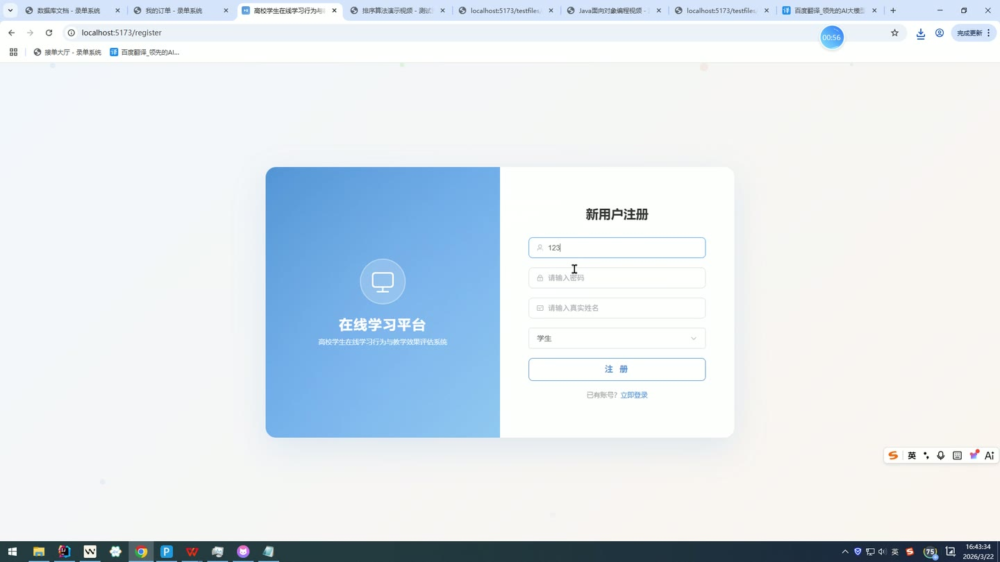
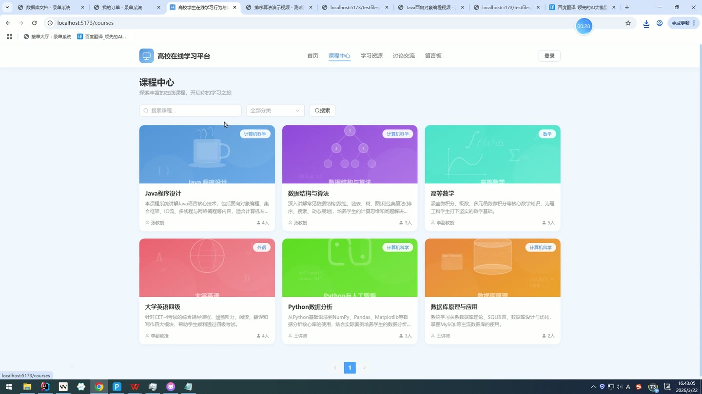
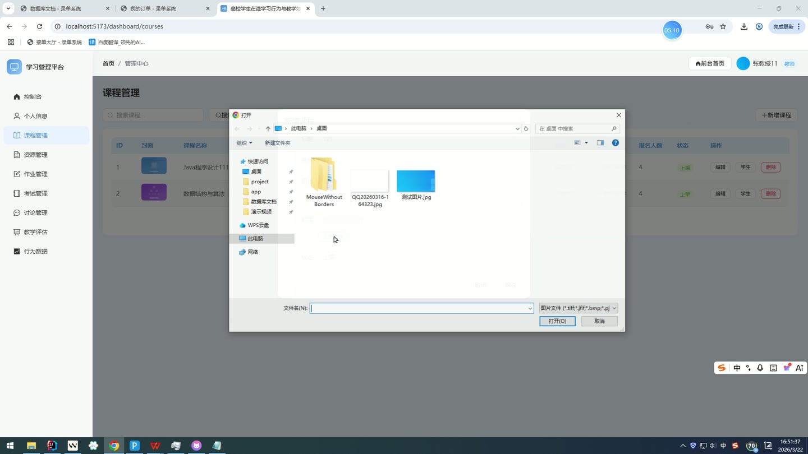
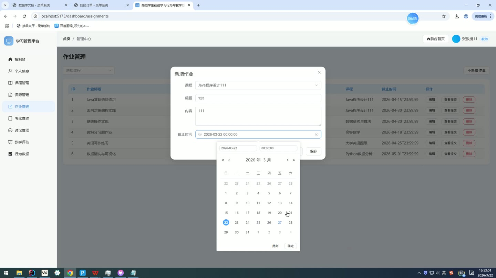
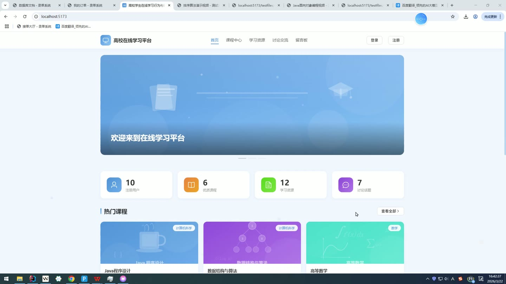
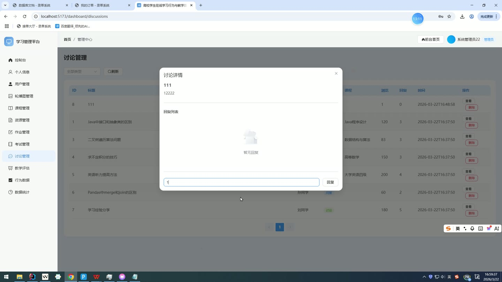

# (附文档)Springboot3+Vue3+MySQL 高校学生在线学习行为与教学效果评估系统

**技术栈**：Springboot3、Vue3、MySQL

### 系统简介

本系统是一套基于 Spring Boot 3 + Vue 3 + MySQL 构建的高校在线学习行为与教学效果评估平台，采用前后端分离架构。系统包含学生、教师、管理员三种角色，覆盖课程学习、作业提交、在线考试、讨论互动、学习行为追踪、教学评价及数据统计等核心教学管理环节。
 
### 核心功能
 
### 普通用户端

 
- 用户注册与登录：通过用户名/密码登录，支持 MD5 加密验证，登录后自动记录登录日志（IP、设备信息）。 
- 个人信息管理：查看和修改个人资料（真实姓名、手机、邮箱、头像、性别），支持修改登录密码（需验证原密码）。 
- 课程浏览与报名：按分类/关键词搜索已上架课程，查看课程详情（含授课教师信息），点击“报名”按钮加入课程，每人每课仅可报名一次。 
- 已选课程管理：查看已报名的课程列表，显示课程名称与报名进度。 
- 作业查看与提交：查看指定课程的作业列表（截止时间、内容），提交作业答案（文本内容或上传文件），支持重复提交并累加提交次数。 
- 考试参与：查看课程下的考试列表（考试时长、起止时间），进入考试后按顺序答题（单选/多选/判断/简答），提交后系统自动批改客观题并计算分数。 
- 我的考试记录：查看个人历史考试记录，包括考试标题、提交时间、得分及答题详情（题目内容、学生答案、正确答案、得分）。 
- 学习资源查看：按课程/关键词/文件类型筛选资源，查看资源详情（自动记录浏览日志），支持下载计数。 
- 视频学习记录：记录视频观看时长、暂停次数、快进/快退次数，生成学习行为日志。 
- 讨论区互动：按课程/类型浏览讨论帖，查看帖子详情（浏览量自动+1），发布新帖，回复他人帖子，帖子回复数自动更新。 
- 站内消息：查看个人收到的消息列表，发送消息给其他用户，支持删除消息。 
- 教学评价：对已学课程进行教学评价（评分+评语），查看个人提交的评价记录。 
- 学习行为看板：查看个人学习行为汇总（总学习时长、视频观看时长、资源浏览数、下载数、讨论数、回复数、作业数、考试数）。 
- 退出登录：安全退出系统，自动记录登出时间。
 
### 管理员端

 
- 用户管理：查看所有用户列表（按角色/关键词筛选），支持启用/禁用账号（状态切换），删除用户。 
- 课程管理：查看所有课程列表（含未上架课程），按教师/关键词筛选，新增、编辑、删除课程（设置标题、描述、封面、分类、授课教师）。 
- 轮播图管理：查看轮播图列表（按排序顺序），新增、编辑、删除轮播图（标题、图片、链接、排序、启用状态）。 
- 资源管理：查看所有学习资源列表，新增、编辑、删除资源（标题、描述、文件类型、所属课程、文件URL）。 
- 公告管理：发布系统级公告（无指定接收人的消息），查看公告列表，删除公告。 
- 数据概览：查看系统整体统计数据（用户总数、学生数、教师数、课程数、资源数、讨论数、报名数、登录次数）。 
- 课程报名统计：查看各课程的报名人数分布（柱状图/饼图数据）。 
- 资源类型统计：按文件类型统计资源数量分布。 
- 学习行为汇总：查看全平台学习行为总和（总学习时长、总视频时长、总资源浏览等）。 
- 登录趋势：按日期统计登录次数，生成登录趋势折线图数据。 
- 成绩分布：统计所有考试记录的成绩分布区间（90-100、80-89、70-79、60-69、60以下）。 
- 教学评价管理：查看所有教学评价列表（按课程/教师筛选），删除评价。
 
### 教师端

 
- 课程管理：查看本人所授课程列表（含搜索），新增、编辑、删除课程。 
- 课程报名管理：查看某课程的所有报名学生列表（学生姓名），为学生的课程成绩评分。 
- 作业管理：为课程创建、编辑、删除作业（标题、内容、截止时间），查看某作业的所有学生提交记录，对提交的作业进行批改（评分+反馈）。 
- 考试管理：为课程创建、编辑、删除考试（标题、描述、时长、起止时间、总分）。 
- 题库管理：为考试添加、编辑、删除题目（支持单选/多选/判断/简答，设置选项ABCD、正确答案、分值、排序）。 
- 考试评分：查看某考试的所有学生考试记录，对简答题进行逐题评分，系统自动累加总分。 
- 学习资源管理：上传、编辑、删除课程学习资源（标题、描述、文件类型、文件URL）。 
- 学生行为查看：查看指定学生的学习行为数据（按课程汇总）。 
- 教学评价查看：查看本人收到的教学评价列表（评分与评语）。
 
### 技术栈

 后端框架Spring Boot 3 ORM 框架MyBatis-Plus 权限与会话HttpSession 会话管理 前端框架Vue 3 状态管理Vue Router（前端路由） 构建工具Vite（前端） 数据库MySQL 文件上传MultipartFile + 本地存储 密码加密Hutool MD5 加密
 
### 交付内容

 
- 后端完整源码 
- 前端完整源码 
- 数据库初始化脚本 
- 万字文档

## 界面展示

---

## 获取完整源码 + 万字文档

本仓库为项目介绍页。**完整前后端源码、数据库初始化脚本、万字项目文档**，请加微信 `kangkangcode`，或访问 [codekk.top](http://codekk.top) 获取。

可作课程设计 / 毕业设计参考，支持远程部署调试。